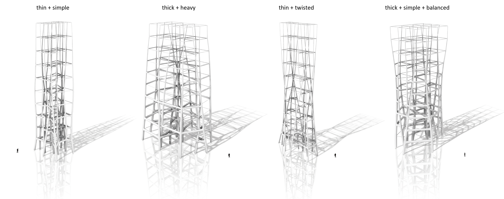
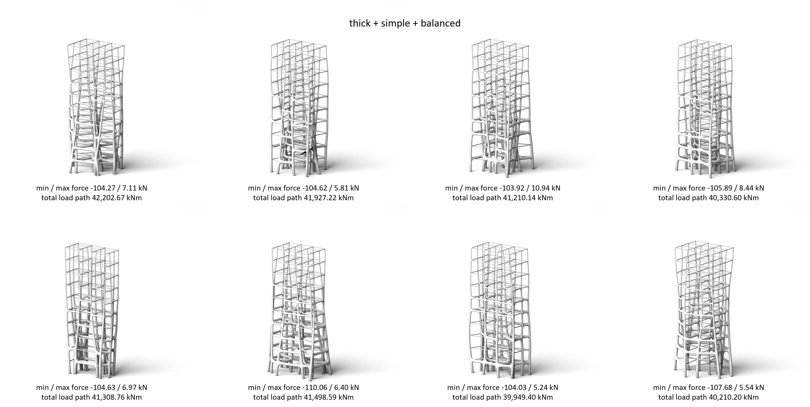
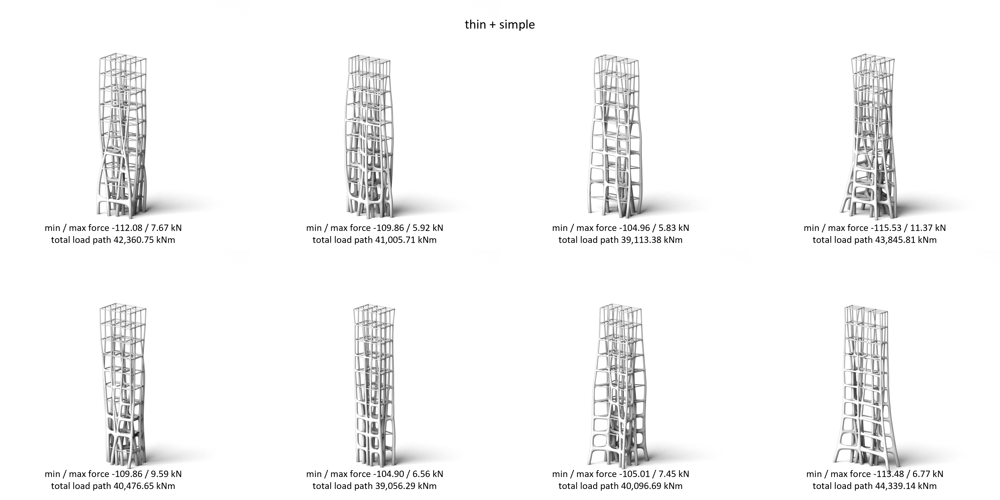

# Text2Form3D: Enhancing structural form-finding through a text-based AI engine coupled with computational graphic statics

This project introduces Text2Form3D, a machine-learning-based design framework to explore the embedded descriptive representation of structural forms.
Text2Form3D joins word embeddings with the Combinatorial Equilibrium Modeling (CEM) to autonomously generate new structural solutions in static equilibrium from a user-defined descriptive query.
The generated structural solutions can be further evaluated by various quantitative and qualitative criteria to constrain the design space towards a solution that fits the designer's preferences.
 
 
The work presented here is a collaboration between the [SHARE-LAB](https://www.ai-share-lab.com/) at University of Florida (Zifeng Guo, Karla Saldana Ochoa)
and the [Professorship of Structural Design](https://www.arc.ed.tum.de/sd/structural-design/) at TUM (Pierluigi D'Acunto).
 

## Sample results

 

## Previous works

This study is based on the previous research of
- Combinatorial Equilibrium Modeling (https://github.com/OleOhlbrock/CEM)
- Self-Organizing Map (https://github.com/sevamoo/SOMPY)
- SDML - Structural Design supported by Machine Learning (https://github.com/pierluigidacunto/SDML)

## Related publication

<b>Zifeng Guo, Karla Saldana Ochoa, Pierluigi D′Acunto</b>: Enhancing structural form-finding through a text-based AI engine coupled with computational graphic statics, Proceedings of the IASS 2022 Symposium, 2086–2096, 2022, Beijing
 
